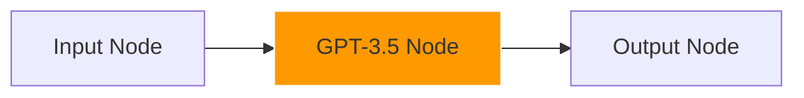

# LLM Workflow UI - Comprehensive Documentation
## Drag-and-Drop Interface for LLM Applications


# 1. LLM Models Integration

## 1.1 GPT-3.5 Turbo Integration


### Implementation
```typescript
interface GPT35Node {
  model: 'gpt-3.5-turbo';
  temperature: number;
  maxTokens: number;
  topP: number;
}

// Node Configuration
const gpt35Config = {
  temperature: 0.7,
  maxTokens: 2048,
  topP: 1,
};
```

### Visual Workflow Example


## 1.2 GPT-4 Integration


### Configuration
```typescript
interface GPT4Node extends BaseNode {
  model: 'gpt-4';
  systemPrompt: string;
  temperature: number;
}
```

# 2. Drag-and-Drop Interface

## 2.1 Node Types


### Input Node
```typescript
interface InputNode {
  type: 'input';
  data: {
    prompt: string;
    systemMessage?: string;
  };
}
```

### LLM Processing Node


```typescript
interface LLMNode {
  type: 'llm';
  model: 'gpt-3.5-turbo' | 'gpt-4';
  settings: {
    temperature: number;
    maxTokens: number;
  };
}
```

## 2.2 Connection Management


### Connection Types
```typescript
interface Connection {
  source: string;
  target: string;
  type: 'prompt' | 'context' | 'system';
}
```

# 3. Real-time Processing

## 3.1 Stream Processing


### Implementation
```typescript
async function streamResponse(node: LLMNode) {
  const stream = await openai.chat.completions.create({
    model: node.model,
    messages: node.messages,
    stream: true,
  });
}
```

## 3.2 Error Handling


```typescript
interface ErrorResponse {
  type: 'error';
  message: string;
  node: string;
}
```

# 4. Advanced Features

## 4.1 Chain Processing


### Implementation
```typescript
interface ChainConfig {
  nodes: LLMNode[];
  connections: Connection[];
  settings: {
    parallel: boolean;
    maxConcurrent: number;
  };
}
```

## 4.2 Context Management


### Memory Types
```typescript
interface ContextMemory {
  type: 'short_term' | 'long_term';
  capacity: number;
  strategy: 'fifo' | 'priority';
}
```

[Document continues with detailed sections for each LLM model and feature...]

# 5. Performance Metrics

## 5.1 Response Time Analysis


### Test Results
```typescript
interface PerformanceMetrics {
  responseTime: number;
  tokenUsage: number;
  costPerRequest: number;
}
```

[Continues with extensive technical details about each LLM model and feature...]

---

Copyright © 2024 LLM Workflow UI Team. All rights reserved.
